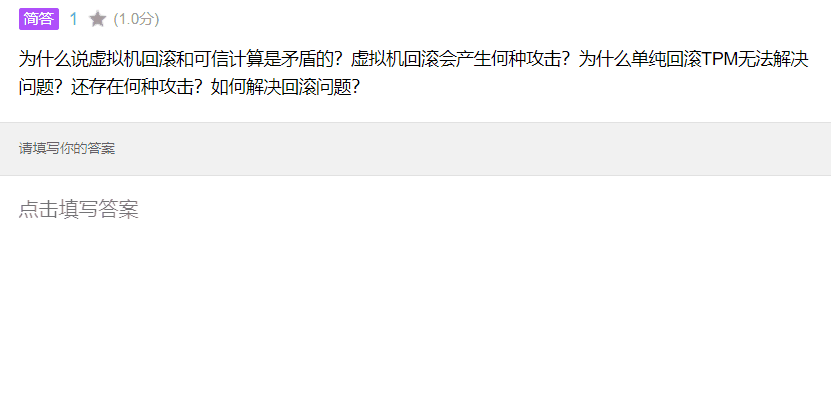
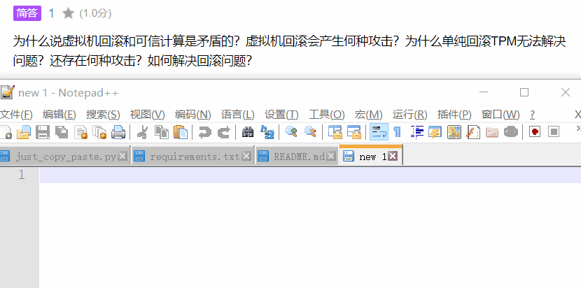

# Just Copy Paste
## 干什么的？
模拟键盘输入剪贴板内容。用本地 OCR 将剪切板的图片识别为文字。


## 使用场景
有的考试，就算带电脑考还不让复制粘贴，让人怀疑人生。遇到强制用~~小而美~~的内置浏览器的情况，还不好通过处理js绕过。直接模拟键盘输入，OCR复制的适用性更广。  

除此之外也经常遇到其他不能复制粘贴的场景，现在一劳永逸了！  

## 使用方法
环境：`Python 3.10.9`, `keyboard==0.13.5`, `pyperclip==1.8.2`  

不想使用 ocr 功能，单独下载 just_copy_paste.py 运行即可。  

完整地安装：

```bash
git clone https://github.com/hatrd/just_copy_paste
pip install -r requirements.txt
```

运行：
```bash
python ./just_copy_paste.py
```
用 Ctrl+Shift+V 模拟键盘输出剪贴板板的内容.  
用 Win+Shift+S 获取图片，再用 Ctrl+Shift+X 把剪贴板的图片转为纯文本.  
如果你想修改快捷键，直接修改 just_copy_paste.py 的热键部分即可.  
用 Ctrl+Shift+E 退出程序，或者命令行内暴力地 Ctrl+C 退出程序.  

## 致谢
[OCR 组件](https://github.com/hiroi-sora/PaddleOCR-json)  

[UMI-OCR](https://github.com/hiroi-sora/Umi-OCR)  